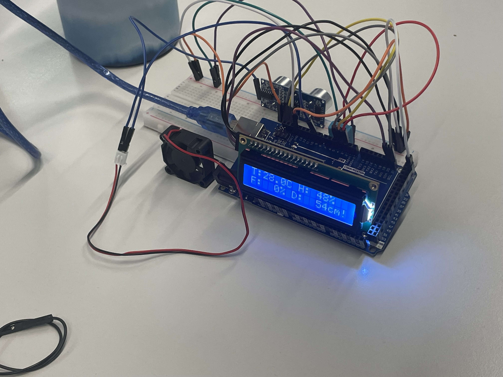
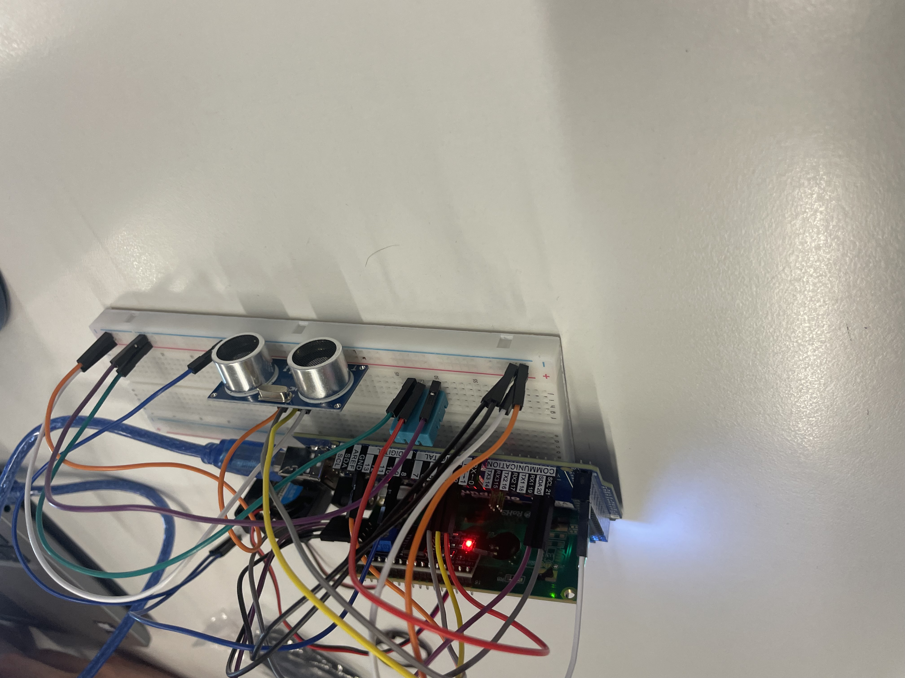
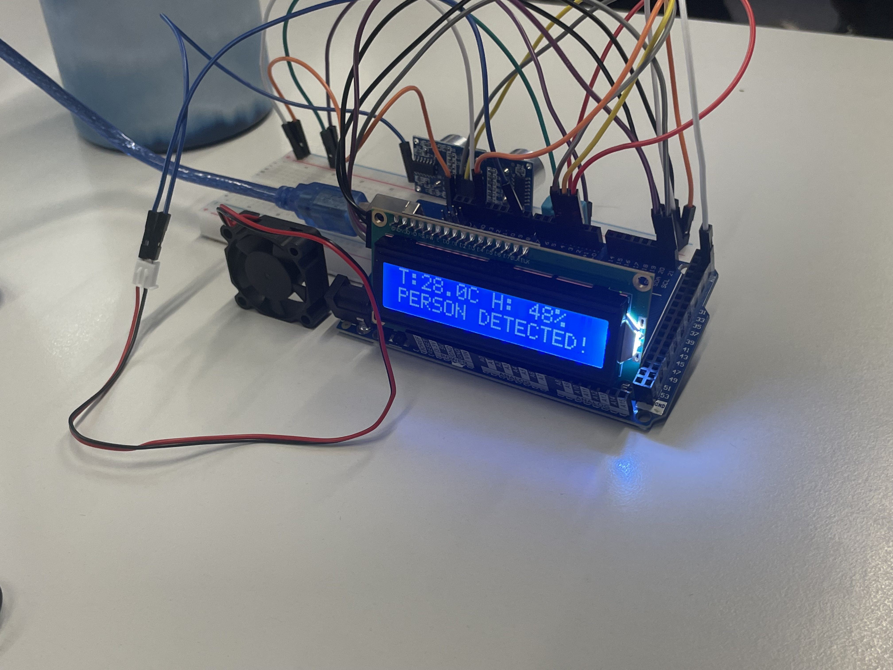

# gvid-Serverraum--berwachung-test

In einem Serverraum, der rund um die Uhr in Betrieb ist, müssen die Temperatur und die Luftzirkulation überwacht werden, um eine Überhitzung der Server und eine ineffiziente Nutzung der Energie zu vermeiden.

## Dokumentation

Dieses Repository enthält eine einfache Serverraum-Überwachung mit Arduino/Fritzing-Dateien sowie Beispiel-Skizzen zur Lüftersteuerung auf Basis von Temperatur- und Luftfeuchtewerten.

### Inhalte

- `serverroom_fan_control.ino` – Basissteuerung für Lüfter.
- `serverroom_fan_control_dht11.ino` – Lüftersteuerung mit DHT11-Sensor.
- `serverroom_fan_control_dht11withtempandhumid.ino` – erweiterte Version mit Temperatur- und Feuchteauswertung.
- `serverraumüberwachung.fzz` – Fritzing-Projektdatei für Verdrahtung/Schaltplan.

### Projektstruktur

```text
.
├── README.md
├── LICENSE
├── serverroom_fan_control.ino
├── serverroom_fan_control_dht11.ino
├── serverroom_fan_control_dht11withtempandhumid.ino
├── serverraumüberwachung.fzz
├── IMG_2060.jpeg
├── IMG_2066.jpeg
└── IMG_2067.jpeg
```

## Bilder

### Aufbau 1



### Aufbau 2



### Aufbau 3


